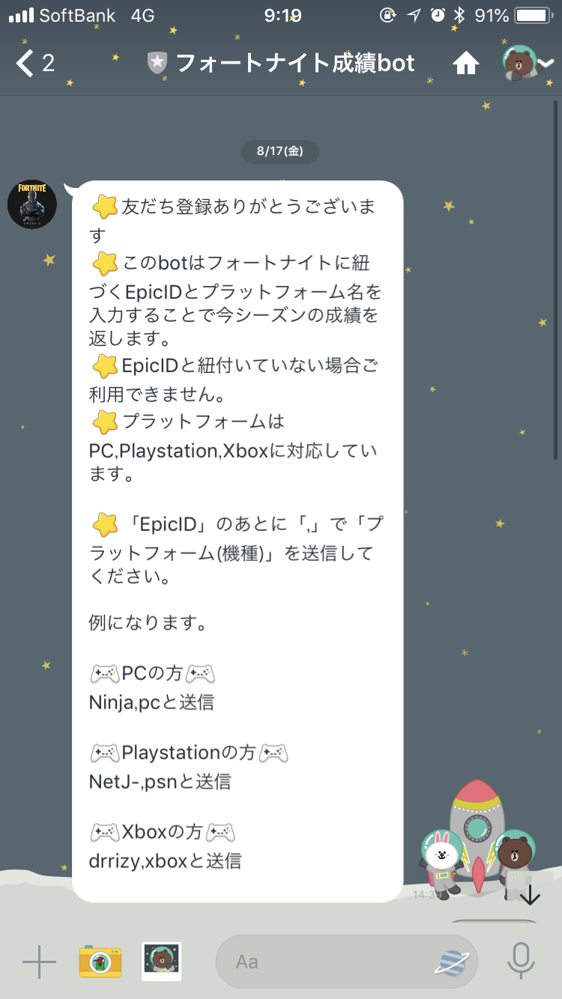
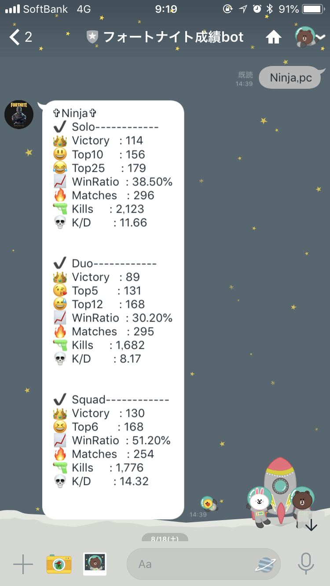

  

<h1>Return the results of Fortnite using LineBot.
</h1>

## Line Bot ✕ FortniteTraker

* [**Line bot**](https://developers.line.me/ja/services/messaging-api/)
* [**FortniteTracker**](https://fortnitetracker.com/)

## Line

## Account
